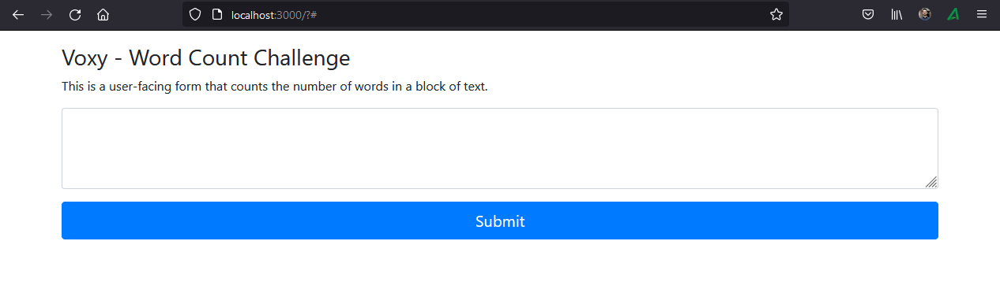
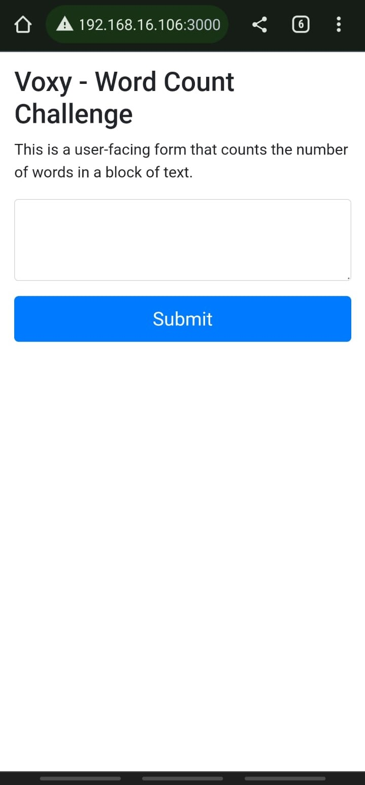

WordCountChallenge
===
## Project Information
- Title:  `Word Count Challenge`
- Authors:  `Emerson Faria de Oliveira`

## Description
It's a user-facing form that counts the number of words in a block of text. The project is divided into two blocks, the backend that will process the data received and the frontend as the user interface. Both pieces are able to communicate with each other.

## Install & Dependence
### Download and install
- [Node.js - v16.15.0](https://nodejs.org/en/download/)
### Dependencies
- cors
- express

## Instalation
### Environment Setup
* Clone the git repository:
  ```
  $ git clone https://github.com/EmersonFariaOliveira/WordCountChallenge.git
  ```
### BackEnd
* Open a new terminal and install the required dependencies
  ```  
  $ cd ./WordCountChallenge/backend
  $ npm install
  ```
* Running the Server
  ```    
  $ npm start
  ```  

### FrontEnd
* Open a new terminal
  ```  
  $ cd ./WordCountChallenge/frontend
  ```

* Running the Server
  ```  
  $ npx lite-server
  ```
## Opening and testing
- Open the application in your web browser. Use Chrome or Firefox for a better experience.
```
http://localhost:3000/
```

- Web Browser




- Smartphone



## Directory Hierarchy
```
|—— .gitignore
|—— backend
|    |—— index.js
|    |—— package.json
|—— frontend
|    |—— index.html
```
## Tested Platform
- Software
  ```
  OS: Windows 10
  NodeJS : v16.15.0
  ```

## References
- [Express](https://expressjs.com/)
- [Bootstrap](https://getbootstrap.com/)
- [npm lite-server](https://www.npmjs.com/package/lite-server)
